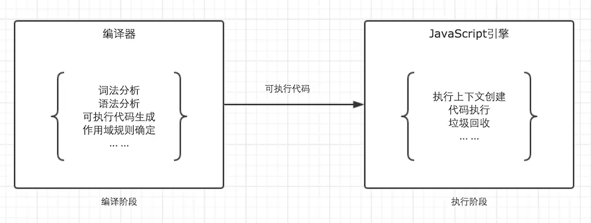
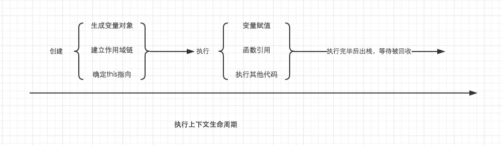
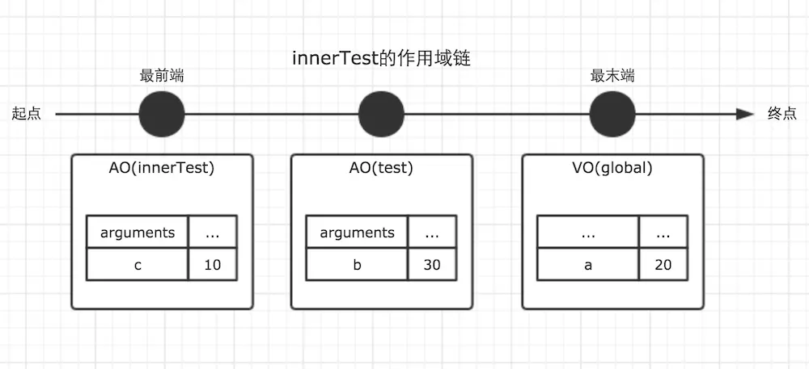
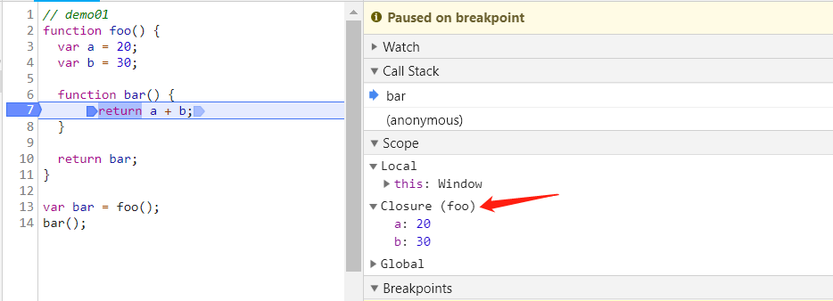
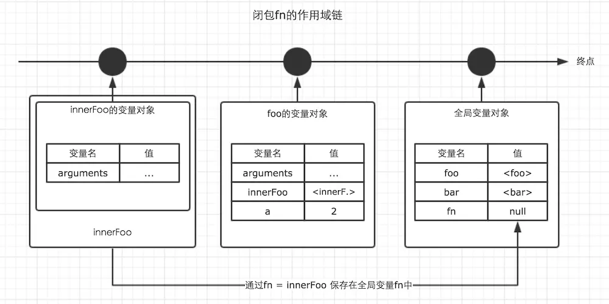
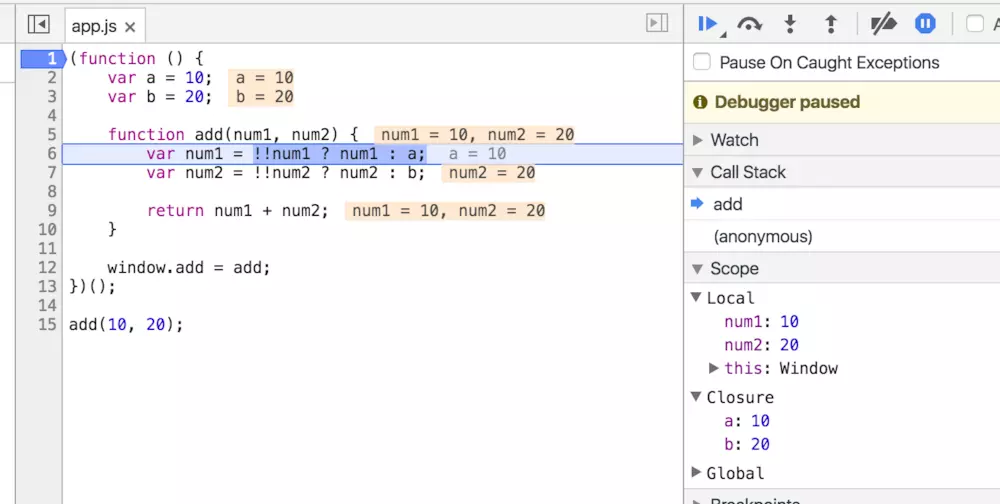

## 回顾
在详细讲解之前，我默认你已经大概明白了JavaScript中的下面这些重要概念。这些概念将会非常有帮助。

* 基础数据类型与引用数据类型
* 内存空间
* 垃圾回收机制
* 执行上下文
* 变量对象与活动对象

## 作用域

在JavaScript中，我们可以将作用域定义为一套规则,这套规则用来管理引擎如何在当前作用域以及嵌套的子作用域中根据标识符名称(变量名或者函数名)进行变量查找。
<br>
JavaScript中只有全局作用域与函数作用域(因为eval我们平时开发中几乎不会用到它，这里不讨论)。
<br>
作用域与执行上下文是完全不同的两个概念。我知道很多人会混淆他们，但是一定要仔细区分。

> JavaScript代码的分为两个阶段，代码编译阶段与代码执行阶段。编译阶段由编译器完成，将代码翻译成可执行代码，这个阶段**作用域规则**会确定。执行阶段由引擎完成，主要任务是执行可执行代码，执行上下文在这个阶段创建。



## 作用域链

回顾一下执行上下文的生命周期，如下图。



我们知道函数在调用激活时，会开始创建对应的执行上下文，在执行上下文生成的过程中，变量对象，作用域链，以及this的值会分别被确定。之前一篇文章我们详细说明了变量对象，而这里，我们将详细说明作用域链。

> 作用域链，是由当前环境与上层环境的一系列变量对象组成，它保证了当前执行环境对符合访问权限的变量和函数的有序访问。

`demo`

```js
var a = 20;

function test() {
    var b = a + 10;

    function innerTest() {
        var c = 10;
        return b + c;
    }

    return innerTest();
}

test();
```

在上面的例子中，全局，函数test，函数innerTest的执行上下文先后创建。我们设定他们的变量对象分别为VO(global)，VO(test), VO(innerTest)。而innerTest的作用域链，则同时包含了这三个变量对象，所以innerTest的执行上下文可如下表示。

```js
innerTestEC = {
    VO: {...},  // 变量对象
    scopeChain: [VO(innerTest), VO(test), VO(global)], // 作用域链
}
```

我们可以直接用一个数组来表示作用域链，数组的第一项scopeChain[0]为作用域链的最前端，而数组的最后一项，为作用域链的最末端，所有的最末端都为全局变量对象。
<br>
很多人会误解为当前作用域与上层作用域为包含关系，但其实并不是。以最前端为起点，最末端为终点的单方向通道我认为是更加贴切的形容。如图。



## 闭包

> 闭包是一种特殊的对象。它由两部分组成：执行上下文(代号A)，以及在该执行上下文中创建的函数（代号B）。当B执行时，如果访问了A中变量对象中的值，那么闭包就会产生。

上面的话可能有点难懂，与大家理解可能也有些出入。稍微解析下这句话：函数A内部有函数B，并且函数B会访问A中的变量。而这里产生的闭包是包括这两部分的，缺一不可。

!> 在大多数理解中，包括许多著名的书籍，文章里都以函数B的名字代指这里生成的闭包。而在chrome中，则以执行上下文A的函数名代指闭包。我觉得chrome更能让人理解

`demo01`

```js
function foo() {
    var a = 20;
    var b = 30;

    function bar() {
        return a + b;
    }

    return bar;
}

var bar = foo();
bar();
```



上面的例子，首先有执行上下文foo，在foo中定义了函数bar，而通过对外返回bar的方式让bar得以执行。当bar执行时，访问了foo内部的变量a，b。因此这个时候闭包产生。
<br>
我们知道，函数的执行上下文，在执行完毕之后，生命周期结束，那么该函数的执行上下文就会失去引用。其占用的内存空间很快就会被垃圾回收器释放。可是闭包的存在，会阻止这一过程。

`demo2`

```js
var fn = null;
function foo() {
    var a = 2;
    function innnerFoo() {
        console.log(a);
    }
    fn = innnerFoo; // 将 innnerFoo的引用，赋值给全局变量中的fn
}

function bar() {
    fn(); // 此处的保留的innerFoo的引用
}

foo();
var a = 20;
console.log(a);
bar(); // 2
```


在上面的例子中，foo()执行完毕之后，按照常理，其执行环境生命周期会结束，所占内存被垃圾收集器释放。但是通过fn = innerFoo，函数innerFoo的引用被保留了下来，复制给了全局变量fn。这个行为，导致了foo的变量对象，也被保留了下来。
<br>
于是，函数fn在函数bar内部执行时，依然可以访问这个被保留下来的变量对象。所以此刻仍然能够访问到变量a的值。这样，我们就可以称foo为闭包。

!> 注意看上图下边我打印的this，this是指向 window 的，并且我在下边又定义了变量a。即使如此，还是产生了闭包。即使此时 this 是 window，但访问的还是闭包的变量对象。是不是又对作用域规则，作用域链多了一些理解呢？

下图展示了闭包foo的作用域链：



所以，通过闭包，我们可以在其他的执行上下文中，访问到函数的内部变量。比如在上面的例子中，我们在函数bar的执行环境中访问到了函数foo的a变量。个人认为，从应用层面，这是闭包最重要的特性。利用这个特性，我们可以实现很多有意思的东西。
<br>
不过读者朋友们需要注意的是，虽然例子中的闭包被保存在了全局变量中，但是闭包的作用域链并不会发生任何改变。在闭包中，能访问到的变量，仍然是作用域链上能够查询到的变量。
<br>
对上面的例子稍作修改，如果我们在函数bar中声明一个变量c，并在闭包fn中试图访问该变量，运行结果会抛出错误。

```
var fn = null;
function foo() {
    var a = 2;
    function innnerFoo() {
        console.log(c); // 在这里，试图访问函数bar中的c变量，会抛出错误
        console.log(a);
    }
    fn = innnerFoo; // 将 innnerFoo的引用，赋值给全局变量中的fn
}

function bar() {
    var c = 100;
    fn(); // 此处的保留的innerFoo的引用
}

foo();
bar();
```

?> 关于这一点，很多同学把函数调用栈与作用域链没有分清楚，所以有的大神看了我关于介绍执行上下文的文章时就义正言辞的说我的例子有问题，而这些评论有很大的误导作用，为了帮助大家自己拥有能够辨别的能力，所以我写了基础（六），教大家如何在chrome中观察闭包，作用域链，this等。当然我也不敢100%保证我文中的例子就一定正确，所以教大家如何去辨认我认为才是最重要的。

## 闭包的应用场景

* 柯里化<br>在函数式编程中，利用闭包能够实现很多炫酷的功能，柯里化便是其中很重要的一种。

* 模块<br>在我看来，模块是闭包最强大的一个应用场景。如果你是初学者，对于模块的了解可以暂时不用放在心上，因为理解模块需要更多的基础知识。但是如果你已经有了很多JavaScript的使用经验，在彻底了解了闭包之后，不妨借助本文介绍的作用域链与闭包的思路，重新理一理关于模块的知识。这对于我们理解各种各样的设计模式具有莫大的帮助。

```js
(function () {
    var a = 10;
    var b = 20;

    function add(num1, num2) {
        var num1 = !!num1 ? num1 : a;
        var num2 = !!num2 ? num2 : b;

        return num1 + num2;
    }

    window.add = add;
})();

add(10, 20);
```

在上面的例子中，我使用函数自执行的方式，创建了一个模块。add是模块对外暴露的一个公共方法。而变量a，b被作为私有变量。在面向对象的开发中，我们常常需要考虑是将变量作为私有变量，还是放在构造函数中的this中，因此理解闭包，以及原型链是一个非常重要的事情。模块十分重要，因此我会在以后的文章专门介绍，这里就暂时不多说啦。



此图中可以观看到当代码执行到add方法时的调用栈与作用域链，此刻的闭包为外层的自执行函数
<br>
为了验证自己有没有搞懂作用域链与闭包，这里留下一个经典的思考题，常常也会在面试中被问到。
<br>
利用闭包，修改下面的代码，让循环输出的结果依次为1， 2， 3， 4， 5

```
for (var i=1; i<=5; i++) {
    setTimeout( function timer() {
        console.log(i);
    }, i*1000 );
}
```

关于作用域链的与闭包我就总结完了，虽然我自认为我是说得非常清晰了，但是我知道理解闭包并不是一件简单的事情，大家一起学习进步。


