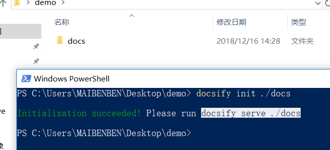
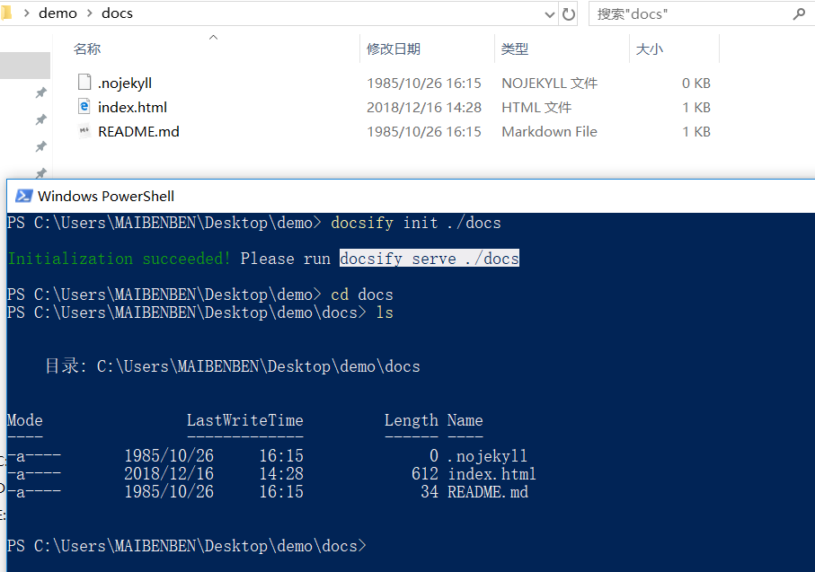
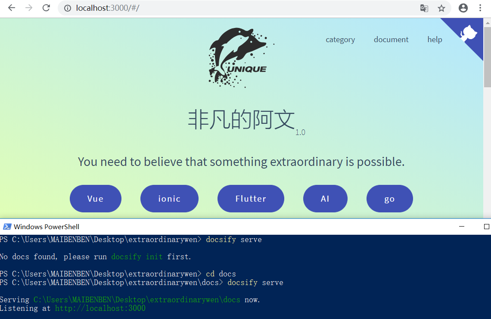
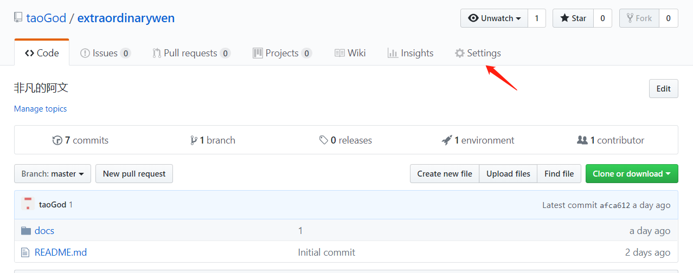
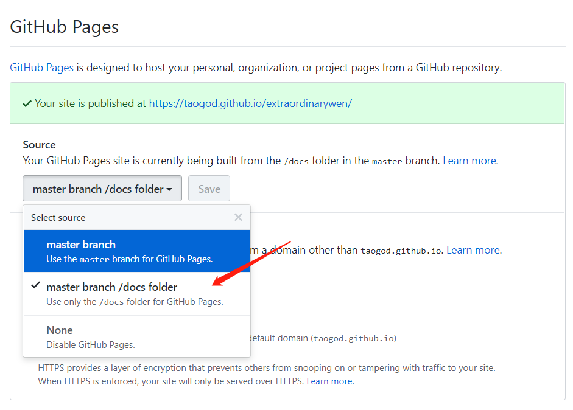

[docsify](https://docsify.js.org)

## 安装
安装node，然后建议全局安装docsify-cli，有助于在本地初始化和预览网站。
```
npm i docsify-cli -g
```
!> 如果需要部署到gitHub，则也安装一下git。

## 初始化
使用init命令初始化。如果要在./docs子目录中编写文档，则可使用下面命令：
```
docsify init ./docs
```



上面是执行命令过程与自动生成的文件的截图，下面简单介绍下docs中的3个文件：
* .nojekyll：让gitHub不忽略掉以 _ 打头的文件
* index.html：整个网站的核心文件
* README.md：默认页面

!> 这里最好只采用docs目录，官方推荐，而且将文档放到gitHub上时，也必须是docs。

## 本地预览文档
进入docs目录，运行本地服务器 `docsify serve`，然后在浏览器中打开 http://localhost:3000即可。
```
// 如果要预览的文档在docs中，则使用 docsify serve 即可。
docsify serve
```


也可以不进入docs目录运行本地服务器：`docsify serve docs`。

## gitHub上预览文档
应该都知道 [gitHub](https://github.com/) 是放置代码的网址，其实它还有一个强大的预览文档的功能。如果将 docsify文档 放置到 gitHub 上，可以通过gitHub直接预览。
* 在gitHub 建个仓库。本文档的仓库名是 [extraordinarywen](https://github.com/taoGod/extraordinarywen)。
* 在本地获取仓库：`git clone https://github.com/taoGod/extraordinarywen.git (仓库地址)`
* 进入本地仓库，初始化docsify：`docsify init ./docs`
* 提交文档并防止到gitHub：
```
git add .
git commit -m 'msg'
git push orgin master // 这个之前需要提供 gitHub 账号和密码
```
* 在此上gitHub看一下该仓库是否有预想的效果了。
* 呵呵，显然还不够，不过只差最后一步了。点击setting，找到 GitHub Pages，配置分支为 master barnch /docs folder，点击保存。然后会自动发布，并且给出发布的网站地址。


* 点击上图中url：Your site is published at url。意不意外，惊不惊喜呢？反正我第一次我是挺惊喜
* 以后你只需要写东西放到该仓库，网站自动会更新。

## 更多
再次推荐：[docsify](https://docsify.js.org)。你也可以继续观看我后边的相关文档。文档基本涵盖官网写的所有内容，而且是通俗易懂的中文，并附带不少标注与图例。