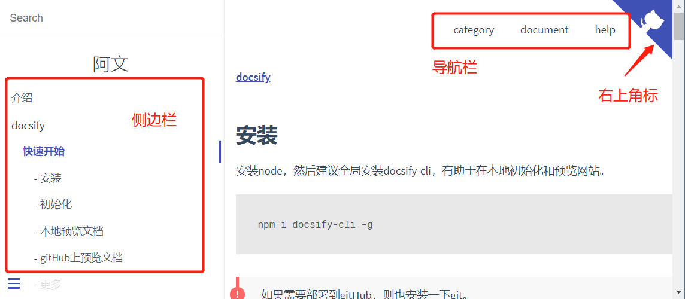
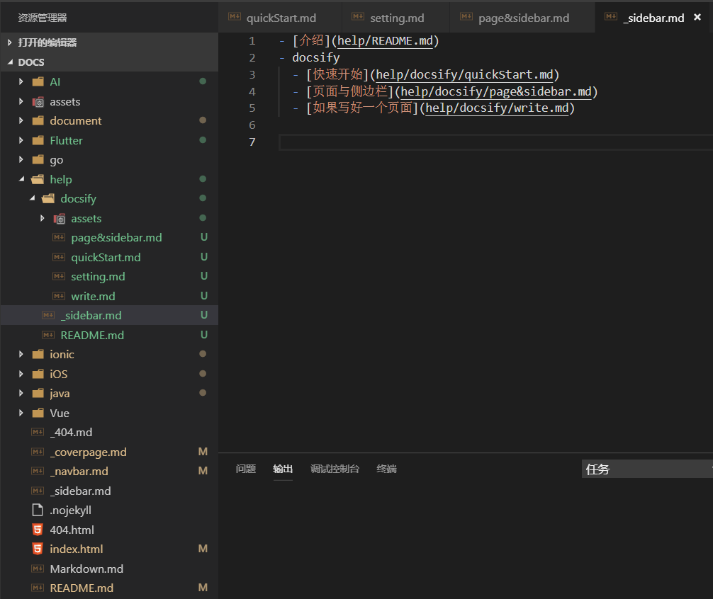

## 侧边栏
docsify中，所有页面都是 markdown格式 的文档。正常按照 markdown格式，但是怎么写了页面需要像 word文档 的 大纲一样进行管理怎么办呢？docsify提供了sidebar。效果如下图：


* 首先，要有这种效果得在 index.html 中开启该功能。

```
<!-- index.html -->

<script>
  window.$docsify = {
    loadSidebar: true
  }
</script>
<script src="//unpkg.com/docsify/lib/docsify.min.js"></script>
```

* 然后创建 `_sidebar.md` 。

```
<!-- help/_sidebar.md -->

- [介绍](help/)
- docsify
  - [快速开始](help/docsify/quickStart.md)
  - [配置](help/docsify/page&sidebar.md)
  - [如果写好一个页面](help/docsify/write.md)
```

!> 暂且叫路由，就是这个上边`()`里的东西，它指向指定页面。如果是`[介绍](help/)`这种`/`后边没有页面名称的则表示选择默认页面`READ.md`。

* 设置侧边栏显示层级

```
window.$docsify = {
  loadSidebar: true,
  subMaxLevel: 2
}
```

* 侧边栏除了显示 `_sidebar.md` 中配置的内容，也会显示页面中的 `##` 标注的标题。

* 侧边栏忽略标题

```
// 忽略所有
# Getting Started {docsify-ignore-all}

// 忽略该标题
## Header {docsify-ignore}
```

!> `_sidebar.md`在什么位置创建是由讲究的，一般在每个模块中配置一个，因为在不同模块有不同的侧边栏。上边笔记中的`_sidebar.md`就是 help 模块的 侧边栏，也就是在help文件夹下创建的。



* 别名的使用。<br>
在正常情况每个模块都会要有一个`_sidebar.md`，并且如果没有 你点击 `[介绍](help/)` 时。你F12检查页面时，会看到报错：找不到 `_sidebar.md` 。

```
alias: {
  '/.*/_sidebar.md': '/_sidebar.md'
}
```

使用别名后，你会发现不会再报这个错了。并且使用了根目录也就是 docs 下的 `/_sidebar.md`。

!> 这虽然看起来不错，全局配置了侧边栏。但同时其他所有模块的`_sidebar.md`都将失效，转而使用根目录下的 `/_sidebar.md`。所以我不这样做，但是 `_navbar.md` 可以比较适合。

```
alias: {
  // '/.*/_sidebar.md': '/_sidebar.md',
  '/.*/_navbar.md': '/_navbar.md'
}
```

## 导航栏
导航栏在上边已经出现过两次，效果类似与菜单。
* 开启。

```
<!-- index.html -->

<script>
  window.$docsify = {
    loadNavbar: true
  }
</script>
<script src="//unpkg.com/docsify/lib/docsify.min.js"></script>
```

* 编辑`_navbar.md`。

```
<!-- _navbar.md -->

- category
  - [Vue](Vue/)
  - [ionic](ionic/)
  - [Flutter](Flutter/)
  - [AI](AI/)
  - [go](go/)

- document
  - [java](java/)
  - [iOS](iOS/)
  - [document](document/)

- help
  - [gitHub](https://github.com/taoGod/extraordinarywen)
  - [help](help/)
  - [home]()
```

!> 导航栏也可以像 侧边栏一样在每个模块中配置。

## 封面
点击 [docsify 首页](https://docsify.js.org/)，即可知道时什么东西了。
* 配置

```
<script>
  window.$docsify = {
    coverpage: true
  }
</script>
<script src="//unpkg.com/docsify/lib/docsify.min.js"></script>
```

* 创建封面文件`_coverpage.md`。

```
<!-- _coverpage.md -->


# docsify <small>3.5</small>

> A magical documentation site generator.

- Simple and lightweight (~21kB gzipped)
- No statically built html files
- Multiple themes

[GitHub](https://github.com/docsifyjs/docsify/)
[Get Started](#docsify)
```

!> 文档站点只能有一个封面！

* 如果存在不同语言版本等特殊情况，也可以给各个版本配置不同的封面。
例如存在中英文两种版本，下面时目录情况
```
.
└── docs
    ├── README.md
    ├── guide.md
    ├── _coverpage.md
    └── zh-cn
        ├── README.md
        └── guide.md
        └── _coverpage.md
```

可以这样配置：
```
window.$docsify = {
  coverpage: ['/', '/zh-cn/']
};
```