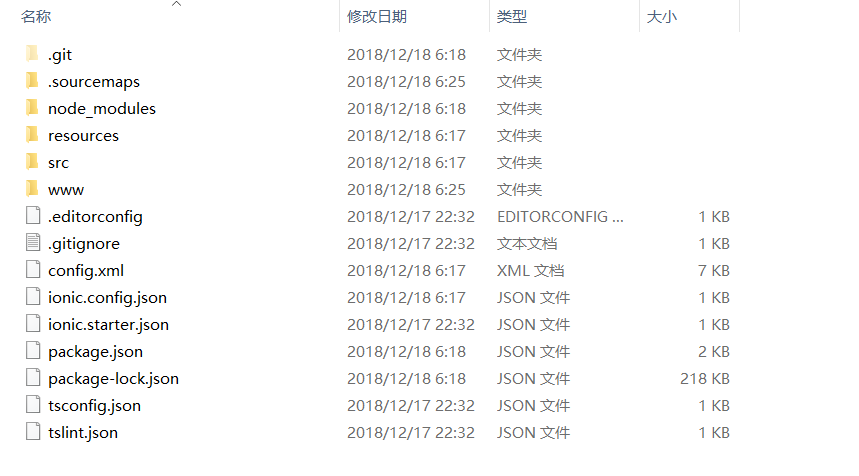
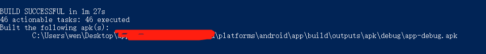

## 安装
安装node，然后使用Node和NPM设置，安装Ionic和Cordova CLI。

```
$ npm install -g ionic cordova
```

## 第一个Ionic应用程序
使用init命令初始化。如果要在./docs子目录中编写文档，则可使用下面命令：
```
// 创建第一个app。模式除了 blank 还有其他种类（tabs等）
$ ionic start helloWorld blank

// 运行app，可在浏览器中预览
$ cd helloWorld
$ ionic serve
```


## iOS部署
* 要求。
  * Xcode 7或更高版本 // iOS原生的应用的唯一开发工具
  * iOS 9
  * 免费的Apple ID或付费的Apple Developer帐户 // Xcode打包必须要有账号登录
* 添加platform
!> 执行添加platform时，可能需要进行授权。`sudo chown -v -R -L mac-username .`
```
$ sudo chown -v -R -L mac-username . // 视权限情况执行
$ sudo ionic cordova platform add ios
```
* iOS 打包
建议百度一下。

## Android部署
* 要求。
  * Java JDK
  * Android SDK
* 安装Java JDK
[Java JDK下载、安装、配置环境变量详解](https://blog.csdn.net/u012187452/article/details/72595040)

* 安装Android SDK
百度吧

* 添加 android platform

```
ionic cordova platform add android
```

* 打包

```
ionic cordova build android                     debug包
ionic cordova build android --release           release包，需要签名验证
ionic cordova build android --release --prod    release包，需要签名验证,对资源进行深度压缩
```



## 生成签名密钥

```
使用工具, 签名：
-genkey表示构建签名文件
-v 显示在dos窗口中
-alias表示签名包的别名
-validity 签名有效期(天)
姓名:填上，用你名字拼音全拼
城市:随便填，不填也行
国家: 随便填，不填也行
密码口令：敲的时候不动，是因为保护隐私，别当做你电脑死机！

$ keytool -genkey -v -keystore demo.keystore -alias demo.keystore -keyalg RSA -validity 20000
```

## 自动给 apk 文件签名
新建 `release-signing.properties`

```
storeFile=demo.keystore
keyAlias=demo.keystore
storePassword=123456
keyPassword=123456
```
然后把 release-signing.properties和demo.keystore文件拷贝到platform/android目录下 执行以下命令，即可打包成签名 apk

```
ionic cordova build android --release  或
ionic cordova build android --release --prod
```

